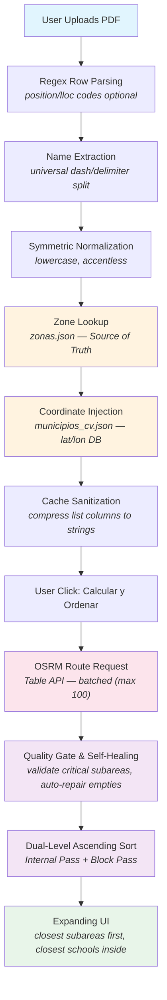

# Adjudicaciones CV

A Streamlit-based system that processes teacher adjudication PDFs from the Conselleria d'Educacio de la Generalitat Valenciana, matches vacancies to official subareas, calculates real road distances and travel times using OSRM, and presents the data in a dual-sorted expanding UI.

## Quick Start

```bash
python -m venv .venv
python -m pip install --require-hashes -r requirements.txt
python -m streamlit run app.py
```

Python 3.10 es la versión mínima y Python 3.12 la recomendada. Para desarrollo,
pruebas reproducibles y la baseline del PDF, consulta
[`docs/baseline.md`](docs/baseline.md).

## Project Overview

Teachers in the Comunitat Valenciana apply for vacant positions (adjudications) through a formal process. This application parses the official PDF listing, enriches each position with geographic and administrative data, calculates real driving distances from the user's home municipality, and groups results by subarea so the user can make informed decisions based on proximity.

The app does **not** use straight-line (Haversine) distances. It queries the public OSRM (Open Source Routing Machine) API to get actual road distances and estimated driving times.

## Architecture and Data Files

Three JSON files serve distinct roles. Understanding which file does what prevents confusion during maintenance.

### zonas.json — Source of Truth for Subarea Mapping

This is the **absolute Source of Truth** for mapping municipality names directly to their official 4-digit subarea codes (e.g., `0311`, `4642`). It is generated from the official Conselleria PDF "Llistat d'areas, subareas, localitats i centres" (Annex I).

Every municipality-to-subarea resolution in the pipeline starts here. If a municipality appears in this file, it gets a subarea. If it does not, fallback layers are attempted.

### municipios_cv.json — Spatial Coordinate Database

This file is used **exclusively** to fetch latitudes and longitudes for OSRM route calculations. It is **not** used for subarea assignment. Its sole purpose is to provide coordinates so the OSRM Table API can compute driving distances and durations.

### areas_subareas.json — Deprecated Fallback Layer

This file was used in earlier versions for center-specific code mappings. It is **deprecated for core matching** and kept only as an isolated fallback layer. Do not rely on it for subarea resolution unless `zonas.json` fails.

## Core Pipeline

The application executes in four controlled phases:

1. **Phase 1 — Lazy Loading**: Without a PDF (uploaded or default), nothing runs. The app stops immediately with a friendly message.
2. **Phase 2 — Cached Parsing + Filter Extraction**: The PDF is parsed once. Filter options are extracted once and cached.
3. **Phase 3 — Master Button + OSRM Calculation**: Distance/time calculation only runs on explicit user click, not on filter changes.
4. **Phase 4 — Session State Persistence**: Results persist across visual option changes (view mode, sort order) without recalculation.

### Mermaid Pipeline Diagram



## Resilient Parsing

The PDF uses inconsistent typography. A single municipality name may appear with ASCII hyphens, en-dashes (U+2013), em-dashes (U+2014), or even slashes separating the base name from sub-localities (pedanias).

The parser uses a single regex to handle all variants:

```python
re.split(r"\s*[\-\u2010-\u2015\/]\s*", muni_name)
```

This means:
- `ELX - ALTABIX` becomes `ELX`
- `ALMORADI - HEREDADES` becomes `ALMORADI`
- `ALMORADI–HEREDADES` (en-dash, no spaces) becomes `ALMORADI`
- `ALMORADI — HEREDADES` (em-dash with spaces) becomes `ALMORADI`
- `Castello de la Plana` stays `Castello de la Plana`

Position codes (Lloc) are optional in the regex. If absent, the parser continues without crashing. This resilience is critical because the PDF format changes periodically between academic years.

## Symmetric Normalization

All municipality names go through a normalization step that is applied **consistently** both when building JSON lookup tables and when resolving names at runtime:

1. Lowercase
2. Strip accents using Unicode NFKD decomposition
3. Remove special characters
4. Collapse whitespace

Example: `ALMORADI` becomes `almoradi`, `ALMORADI` becomes `almoradi`, and `Aldaia` becomes `aldaia`.

This symmetry ensures that lookups against `zonas.json` and `municipios_cv.json` never fail due to case or accent differences.

## Dual-Level Ascending Sorting

The sorting engine in `bloques.py` applies two strict passes:

### Internal Pass
Within each subarea block, all positions are sorted from closest to farthest by the user's chosen metric (distance or time). Unresolved routes (missing coordinates) sink to the bottom with `float('inf')`.

### Block Pass
Subarea blocks themselves are sorted by their closest municipality to the origin. A block whose closest school is 5 km away appears before one whose closest school is 30 km away. Blocks with no resolved coordinates sink to infinity at the bottom.

The result: the user always sees the closest subarea first, and inside it, the closest school first.

## Streamlit Cache Shielding

The `Obs_Tags` column is produced as a Python list by `parse_adjudicacion()`. Lists are unhashable and break Streamlit's internal hashing for `@st.cache_data`.

Before any DataFrame is cached, the `_sanitize_for_cache()` function compresses list columns into comma-separated strings:

```python
df["Obs_Tags"] = df["Obs_Tags"].apply(
    lambda x: ", ".join(x) if isinstance(x, list) else x
)
```

This ensures clean hashlib serialization without `TypeError: unhashable type: 'list'`.

## Quality Gate and Self-Healing Firewall

After subarea assignment, `match_coords.py` runs assertions on known critical municipalities:

| Municipality | Expected Subarea |
|---|---|
| ALMORADI | 0361 |
| ALBAL | 4644 |
| ALDAIA | 4642 |
| COFRENTES | 4635 |

Before raising an assertion error, the quality gate attempts **self-healing**: it scans for rows where `Zona_Subarea` is empty and attempts inline repair using accent-insensitive keyword matching. Only if the repair fails does it raise with diagnostic details.

A second layer validates suffix-qualified municipality names (e.g., `ELX - ALTABIX` must resolve to the same subarea as `ELX`).

Block sorting is also validated: the list of blocks must be strictly ascending by the chosen metric.

## File Structure

```
municipios/
  app.py                      Main Streamlit application
  adjudicacion.py             PDF parser + multi-criteria filter engine
  bloques.py                  Subarea grouping + dual-level sorting + OSRM batching
  match_coords.py             Coordinate injection + quality gate assertions
  calcular_rutas.py           Standalone OSRM route calculator (CLI)
  parse_zones.py              Annex I PDF parser for zone generation
  parse_areas_subareas.py     Legacy parser (deprecated)
  generate_municipios_cv.py   Utility to generate municipios_cv.json
  generate_zonas_fallback.py  Utility to generate fallback zone data
  zonas.json                  Source of Truth: municipality -> subarea mapping
  municipios_cv.json          Coordinate database: lat/lon for OSRM
  areas_subareas.json         Deprecated fallback layer
  requirements.txt            Python dependencies
  test_*.py                   Test files
```

## Dependencies

- `streamlit>=1.30.0`
- `pandas>=2.0.0`
- `openpyxl>=3.1.0`
- `pypdf>=4.0.0`

No API keys are required. The OSRM public instance (`router.project-osrm.org`) is used for all route calculations.
